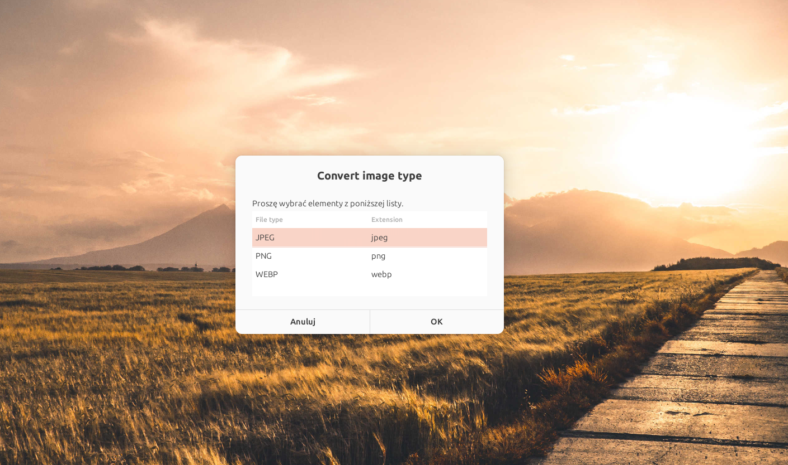

### Nautilus Image Converter (ConvertImage.sh)

#### Overview
`ConvertImage.sh` is a Bash script that integrates with the Nautilus file manager in Linux, providing a convenient right-click option to convert image files to different formats. Utilizing `zenity` for a graphical interface and `convert` from ImageMagick, it allows users to easily convert images to JPEG, PNG, or WEBP formats.

#### Requirements
- Linux with Nautilus file manager
- Zenity
- ImageMagick

#### Installation
1. Download `ConvertImage.sh` to your desired directory.
2. Make the script executable: `chmod +x ConvertImage.sh`.
3. Place the script in `~/.local/share/nautilus/scripts/` to integrate with Nautilus.

#### Usage
1. Right-click on an image file in Nautilus.
2. Navigate to 'Scripts' > 'ConvertImage.sh'.
3. Select the desired output format from the Zenity dialog.
4. The script will convert the selected image to the chosen format.

#### Script Details
The script works as follows:
- It presents a Zenity list dialog to choose the output image format.
- If no format is selected, the script exits.
- The selected image paths are processed with the `convert` command from ImageMagick to change their format.

#### Notes
- Ensure that all dependencies are installed for the script to work correctly.
- The script only processes files selected when it is executed.

#### Contributing
Feel free to contribute to this script by submitting pull requests or opening issues for any bugs or feature requests.
